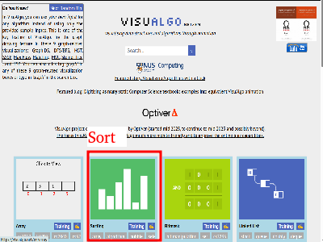

<h1>実習のページ</h1>

次のリンクからそれぞれ実際に体験してみよう。

<h2>1.数学</h2>
　1.高校入試で出題された数学をアルゴリズムで考える。
<a href="https://y2020am.github.io/Entrance_Q5" target="_blank">リンク...</a>
 

<h2>2.アルゴリズム</h2>
<h3>2.１ 並べ替え</h3>
　並べ替えの方法にはいくつかのアルゴリズムが存在する。シミュレータを使ってカードを実際に並べ替えてみよう 

<video width="400" height="300" src="bubbleSort_400x300.mp4" controls muted></video>
<a href="https://visualgo.net/en" target="_blank">リンク...</a> 

   

<h2>3.論理回路</h2>
　3.1 コンピュータを構成する要素でもある論理回路 
　AND回路、OR回路、NOT回路、、、、、、 
これらを実際にシミュレータで体験しよう。
<a href="https://www.falstad.com/circuit/" target="_blank">リンク...</a>

