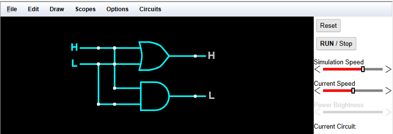

<h1>実習のページ</h1>

　次のリンクからそれぞれ実際に体験してみよう。

<h2>1.数学</h2>
　高校入試で出題された図形の問題をアルゴリズムを使って解いてみよう。 
この問題は、はじめに放物線と一次関数との間に２つの三角形(青線で囲まれた部分)を作成し、さらにｘ軸上の点を1点とした三角形(赤線で囲まれた部分)を作成する。このとき先に作成した２つの三角形の面積とあとに作成した三角形の面積を比較していくものである。 

<a href="/Entrance_Q5/index.html" target="_blank">リンク...</a>  

<h2>2.アルゴリズム</h2>
<h3>2.１ 並べ替えアルゴリズム</h3>
　並べ替えの方法にはいくつかのアルゴリズムが存在します。例えば、バブル・ソート、選択ソートやクイックソートなどがあります。はじめに並べ替えの基本とされるバブル・ソートを映像、シミュレータで学び、次の章では実際にカードを使って並べ替えを体験しよう。 
<video width="400" height="300" src="bubbleSort_400x300.mp4" controls muted></video>

<a href="https://visualgo.net/en" target="_blank">リンク...</a>  

<h3>2.2 カードを使った体験</h3>
　ここでは実際にカードを使って並べ替えを行ってみよう。 

<a href="/Sorting_cards/index.html" target="_blank">リンク...</a>  

<h2>3.論理回路</h2>
<h3>3.1 コンピュータを構成する要素、論理回路</h3>
　コンピュータは、AND回路、OR回路、XOR回路、NOT回路回路などで構成され、多くの命令を高速に処理しています。そのためこれらの基本となる回路の動作を理解しておくことは重要です。次のシミュレータを使って実際に回路を組み立てその動きを確認しよう。
 まずは使い方を覚えよう。
 <a href="How_to_use_logic.pdf"  width="80%" height="80%" target="_blank">リンク...</a> 

<a href="https://www.falstad.com/circuit/" target="_blank">リンク...</a>  

